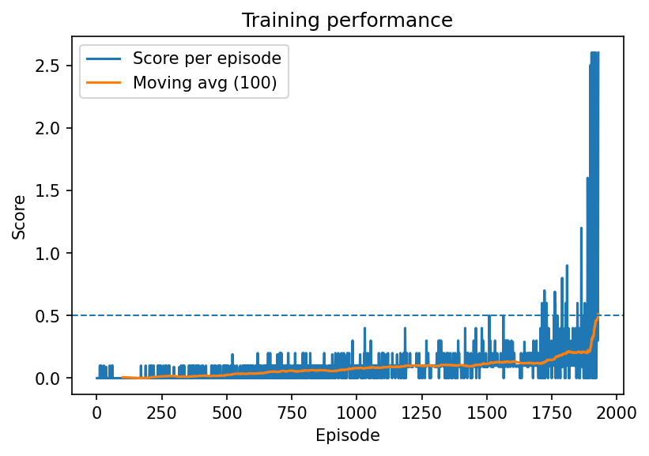

# Colaboration and Competition - Tennis Project

## Introduction 

The environment consists of two agents with rackets bouncing a ball over a net. If an agent hits a ball over a net it receives +0.1 points. If an agents lets the ball hit the ground or go out of bounds, it receives a reward of -0.1. The goal of both agents is to keep the ball in play. 

The environment uses the tennis unity enginer environment with 24 states between the 2 agents.  Each agent receives its own local observation.  Each agent can move toward or away the net and jumping. The 24-dimensional state per agent consists of 8 variables (position/velocity of ball and racket) stacked over the last 3 time steps for temporal context.  This is a cooperative-competitive multi-agent environment, where agents must learn to coordinate while competing, making it suitable for algorithms like MADDPG that handle non-stationarity.

In order to solve the environment the agents must achieve an average score of +0.5 over 100 consecutive episodes. 

The training and environment simulations occured on a cpu with the pc running windows. 

## Learning Algorithm

The underlying learning algorithm used behind each agent is the Deep Deterministic Policy Gradient (DDPG) method which has been shown to effectively handle continuous action spaces.  DDPG is a well known DRL algorithm that adopts an actor critic approach merging the strengths between policy and value based methods. In DDPG the actions are carried out by the actor network and those actions will be evaluated by a critic network. It's ability to handle high dimension state and actions spaces was chosen to better control the racket in the tennis unity environment. 

A Modular DDPG class was implemented to simplify training between two agents controlling the rackets.  The DDPG class uses an Off-model approach with local and target critic and actor networks.  Each Actor/Critic network consists of 2 hidden layers with 256  each.  

A MADDPG class responsible for orchestrating both agents kept a single shared replay buffer. Each agents `2x24` obserations recieved from the environment were flattened to a `1x48` array for more effecient memory storage.  After each env step the MADDPG class iterates over each agent for learning drawing from the single shared replay buffer iteratively 2 to 3 times per step.

Each DDPG agent uses a centralized critic that evaluates the joint states and actions of both agents, addressing multi-agent non-stationarity, while actors remain decentralized (using only local observations).  The critic's goal is to make its prediction (q_expected) match the target (q_target) or bootstrapped calculated value.  The critic's parameter weights are changed throughout training to minimize this value.  The actor's goal is to perform actions that the critic will judge favorably (i.e., give a high Q-value to). The actor wants to maximize the critic's output.

The shared replay buffer stores joint experiences to ensure consistent sampling across agents, with uniform random sampling during learning.  Target networks are updated softly with tau=1e-3 to stabilize training

### Challenges

1. Smaller buffer sizes and batch sizes limited the diversity and breadth of experiences for learning taking longer to solve the environment. 
2. Only limiting experiences per agent limited the diversity of experiences taking longer to solve the environment. 
3. Higher learning rates for the actor/critic destabilized learning, didn't make learning quicker and sometimes didn't converge. 
4. Not having modular DDPG code increased the complexity and made it difficult to get the solution to converge at first.
5. Initial runs showed flat rewards due to exploration issues. 
6. tuning OU noise and multiple updates per step helped accelerate learning.

### Hyperparameters

Lower LR's for actor/critic were crucial in preventing late episode instability.  Increase buffer size and batch size noticeably decreased training time.

Below are the chosen hyperparameters chosen as the optimal solution: 

```
BUFFER_SIZE      = 1000000
BATCH_SIZE       = 1024
GAMMA            = 0.99
TAU              = 1e-3        # slow target updates
LR_ACTOR         = 5e-5        # lower learning had more stability
LR_CRITIC        = 5e-4
WEIGHT_DECAY     = 0.0
SEED             = 2
NOISE_START      = .5
T_STOP_NOISE     = 30000


UPDATE_EVERY     = 2           # learn once every 2 env steps
UPDATES_PER_STEP = 2           # two gradient step per learn
POLICY_DELAY     = 1           # no delay (simpler)

OU_MU            = 0.0
OU_THETA         = 0.15
OU_SIGMA_START   = 0.2
OU_SIGMA_END     = 0.2         # no decay (constant)
OU_SIGMA_DECAY   = 0.0
```

## Plot of Rewards

Rewards remained low until ~episode 800 due to initial exploration challenges, then steadily improved as agents learned coordination. The environment was solved in 1929 episodes, better than baseline MADDPG runs (often 2500+).

Below is a plot of rewards and print out every 100 episodes

```
Episode 100	Average Score: 0.007
Episode 200	Average Score: 0.002
Episode 300	Average Score: 0.018
Episode 400	Average Score: 0.018
Episode 500	Average Score: 0.026
Episode 600	Average Score: 0.037
Episode 700	Average Score: 0.050
Episode 800	Average Score: 0.061
Episode 900	Average Score: 0.057
Episode 1000	Average Score: 0.081
Episode 1100	Average Score: 0.085
Episode 1200	Average Score: 0.099
Episode 1300	Average Score: 0.097
Episode 1400	Average Score: 0.105
Episode 1500	Average Score: 0.114
Episode 1600	Average Score: 0.132
Episode 1700	Average Score: 0.118
Episode 1800	Average Score: 0.195
Episode 1900	Average Score: 0.251
Episode 1929	Average Score: 0.513
Environment solved in 1929 episodes!	Average Score: 0.513
```


## Ideas for future work

1. PER: Implement to prioritize high TD-error experiences, potentially reducing episodes to solve by 20-30% by focusing on informative transitions.
2. Noise Degradation: Introduce gradual OU sigma decay (e.g., from 0.2 to 0.05) to balance exploration and exploitation, avoiding over-randomness late in training.
3. Shared Models: Explore parameter sharing between agents' actors/critics to reduce parameters and improve generalization in symmetric environments like Tennis.

## References

Lillicrap et al. (2015) for DDPG.

Lowe et al. (2017) for MADDPG.